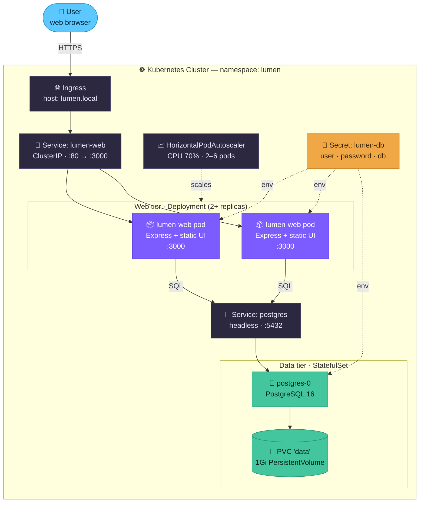
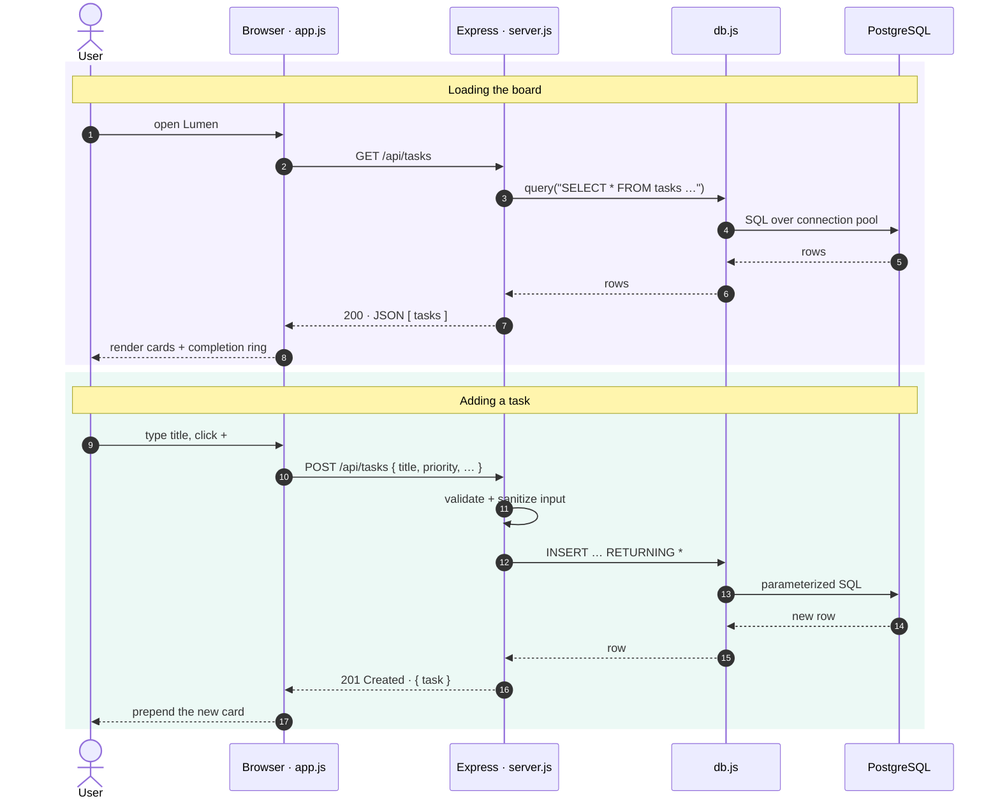
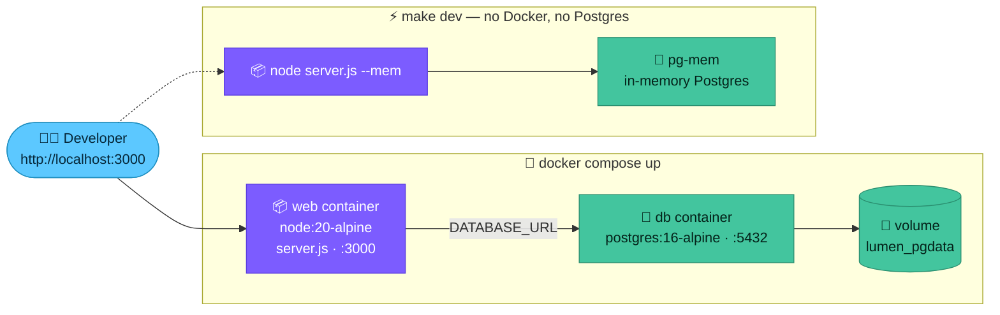
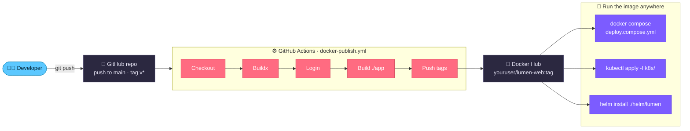
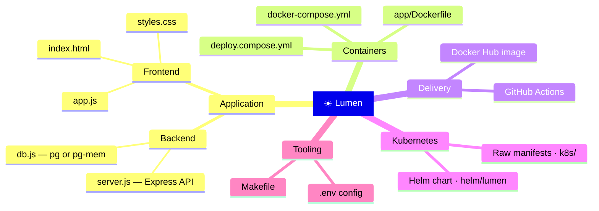

# 🏛️ Lumen — Architecture

A visual tour of the whole system, from a click in the browser down to a row in
Postgres, and from a `git push` out to a running Kubernetes cluster. Every box is
colored by what it *is* — see the [legend](#-legend) at the bottom.

| Diagram | Shows |
|---------|-------|
| [1. Production topology](#1--production-topology-kubernetes) | How Lumen runs on a Kubernetes cluster |
| [2. Request lifecycle](#2--request-lifecycle) | What happens on load + on "add task" |
| [3. Local development](#3--local-development) | Docker Compose and the no-Docker path |
| [4. Delivery pipeline](#4--delivery-pipeline-cicd) | Code → image → any environment |
| [5. The whole system at a glance](#5--the-whole-system-at-a-glance) | Everything in one map |

---

## 1 · Production topology (Kubernetes)

**Read it top-down:** the browser hits the **Ingress**, which forwards to the
**web Service**, which load-balances across stateless **web pods**. Each pod talks
SQL to the **headless Postgres Service**, which points at the single **`postgres-0`**
pod, whose data lives on a **PersistentVolume** that survives restarts. The
**Secret** injects DB credentials into both tiers; the **HPA** adds/removes web
pods based on CPU.

---

## 2 · Request lifecycle

The same two-step shape (`Browser → Express → db.js → Postgres` and back) covers
every action — toggle, edit, delete, and reorder just swap the verb and SQL.

---

## 3 · Local development

Two ways to run it locally: full **Docker Compose** (real Postgres + a persistent
volume), or **`make dev`** which swaps the database layer for an in-memory one —
same code, zero install.

---

## 4 · Delivery pipeline (CI/CD)

One push builds one image; that single artifact is what runs in **every**
environment — Compose, raw manifests, or Helm.

---

## 5 · The whole system at a glance

---

## 🎨 Legend

| Color | Meaning |
|-------|---------|
| 🟦 **Blue** | the user / developer (a human) |
| 🟪 **Violet** | the Lumen application (Express + UI) |
| 🟩 **Green** | data — PostgreSQL, volumes, in-memory store |
| 🟥 **Pink** | CI/CD build steps |
| ⬛ **Slate** | platform/infra — Services, Ingress, Docker Hub, GitHub |
| 🟧 **Amber** | configuration & secrets |

> Solid arrows = request/data flow. Dashed arrows = configuration or control
> (e.g. a Secret injecting env vars, or the HPA scaling a Deployment).

These diagrams render automatically on GitHub and in any Mermaid-aware viewer
(VS Code, Obsidian, Notion). To export an image:
`npx -y @mermaid-js/mermaid-cli -i ARCHITECTURE.md -o architecture.svg`.
